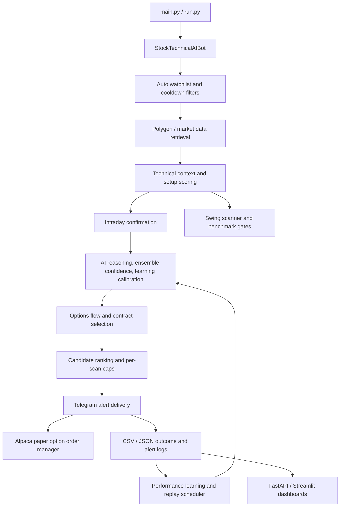

# StockeAlerts Architecture

## Purpose and Scope

StockeAlerts is an AI-assisted market scanning and alerting system for intraday options setups, swing setups, market context analysis, adaptive learning, paper option order management, and performance review. The system is designed as an educational and research workflow: it collects market data, builds technical context, scores candidate trades, applies AI and probabilistic quality gates, sends Telegram alerts, records outcomes, and feeds those outcomes back into future scoring.

This document describes the current repository architecture, the major runtime flows, and the responsibilities of the core modules.

## High-Level System View



## Runtime Entrypoints

| Entrypoint | Responsibility |
| --- | --- |
| `main.py` | Async launcher that applies runtime enhancements to `StockTechnicalAIBot`, creates the bot with `BASE_WATCHLIST`, and starts the scan loop. |
| `run.py` | Equivalent script-style launcher for running the bot directly. |
| `dashboard.py` | FastAPI application exposing JSON endpoints for recent trades and aggregate performance. |
| `streamlit_dashboard.py` | Streamlit-oriented CSV reader used for dashboard/reporting workflows. |
| `learning_replay_scheduler.py` | CLI/scheduler entrypoint for replaying backtests when learning model fingerprints change. |

## Core Components

### 1. Configuration and Environment

`config.py` centralizes operational defaults, environment-derived credentials, score thresholds, watchlists, risk controls, scan cadence, options settings, and market-session controls. It also normalizes API keys and defines the New York market timezone used by scan and alert logic.

Important configuration categories include:

- Alert modes: intraday alerts, swing alerts, outcome tracking, and unauthorized-outcome suppression.
- Scoring thresholds: intraday minimums, swing minimums, AI confidence floors, quality-gate behavior, and early-session grace controls.
- Watchlists: core, secondary, speculative, deprioritized, and master watchlists.
- Risk settings: account size, risk percentage, max position size, and Phase 5 risk-plan inputs.
- Provider credentials: OpenAI, Polygon/Massive-compatible data, Telegram, and Alpaca.

### 2. Bot Orchestration

`bot.py` contains `StockTechnicalAIBot`, the main orchestration class. It extends `StockTechnicalBase` from `bot_technical.py` and owns the end-to-end intraday scan flow:

1. Manage open paper option positions at the start of each loop.
2. Skip scans outside regular market hours or configured quality trading windows.
3. Build an active watchlist for the day.
4. Build one candidate per ticker by collecting technical context, scoring call/put setups, applying AI score overrides, adapting score floors to market phase, confirming intraday structure, running deeper reasoning, selecting options flow/contract data, and computing a ranking score.
5. Sort candidates by rank and send only the best candidates when ranked alert caps are enabled.
6. Send Telegram alerts, optionally place paper option orders, log alert fields, and track outcomes.
7. Sleep in chunks while continuing to manage open option positions.

The orchestration layer is intentionally defensive: unavailable AI, chart capture, options flow, or broker services fall back or fail closed depending on whether the missing component is required to keep the alert actionable.

### 3. Market Data and Technical Context

`bot_technical.py` provides `StockTechnicalBase`, which handles data acquisition, watchlist construction, technical indicator calculations, market schedule checks, sector confirmation, market bias/regime lookups, and raw call/put technical setup scoring.

Key responsibilities:

- Pull historical aggregate bars and grouped daily data from Polygon/Massive-compatible APIs.
- Merge base watchlists with active mover discovery.
- Compute SMA, EMA, ATR, multi-timeframe trends, VWAP/EMA context, ORB levels, previous-day levels, extended-hours metrics, relative volume, and realtime price overlays.
- Determine whether a ticker is in cooldown or has already triggered recently.
- Score directional CALL and PUT setup candidates before AI and ensemble adjustments.

`market_data.py` is a simpler data utility that retrieves stock history through `yfinance` and computes common indicators for non-core workflows.

### 4. Intraday Setup Quality Path

The intraday path uses several focused modules:

| Module | Role |
| --- | --- |
| `intraday_confirm.py` | Confirms short-term structure, required confirmations, relative volume, trigger distance, and early-session grace behavior. |
| `ai_scoring.py` | Produces an AI-adjusted setup score before deeper reasoning. |
| `market_phase.py` | Classifies phase context such as trend, range, pullback, breakout-building, fake-breakout, exhaustion, or open-drive conditions. |
| `ensemble_confidence.py` | Converts technical, regime, vision, execution, learning, and setup-decay signals into dynamic score floors, ensemble score, no-trade score, probability profile, and quality rank. |
| `ai_reasoning_engine.py` | Builds the final reasoning report, including market context, MTF confirmation, setup quality, vision quality, learning confidence, context memory, probabilities, and risk plan. |
| `chart_capture.py` / `chart_ai.py` / `vision_ai.py` | Capture and score chart images when the candidate is strong enough to justify vision analysis. |

The result is a candidate object containing technical context, setup metadata, AI verdict, calibrated confidence, reasoning report, options data, ranking score, and learning context.

### 5. Swing Setup Path

Swing-trade functionality is separated from the intraday scalping path:

| Module | Role |
| --- | --- |
| `swing_scanner.py` | Scores longer-horizon setups using trend, RSI, MACD, volume, ADX proxy, structure, relative strength, market structure stage, VCP/retest behavior, and ATR extension risk. |
| `swing_integration.py` | Applies benchmark gates, mixed-MTF allowances, regime alignment, option-selection handling, swing alert logging, and final alert dispatch integration. |
| `multi_timeframe_engine.py`, `mtf_confirm.py`, `smc_confirm.py` | Provide multi-timeframe and structure confirmations used by swing and reasoning flows. |

Swing alerts can continue as equity-style alerts when no orderable option contract is available, while intraday options automation requires valid order details before sending an actionable option alert.

### 6. AI, Learning, and Adaptive Scoring

The system uses AI as one layer in a broader rules-and-learning stack rather than as the only decision maker.

| Module | Responsibility |
| --- | --- |
| `openai_models.py` | Shared OpenAI chat option construction, including reasoning-model defaults. |
| `ai_analyst.py`, `ai_reasoning_engine.py`, `pre_trade_ai.py`, `trade_management_ai.py`, `exit_ai.py` | AI-assisted analysis, pre-trade checks, management decisions, and exits. |
| `performance_learning.py` | Calibrates confidence and priority bonuses from historical setup performance. |
| `adaptive_scoring.py`, `self_tuning.py`, `projection_learning.py`, `ml_learning.py`, `ml_sklearn_model.py` | Adaptive/ML scoring, tuning, and forecast learning helpers. |
| `trade_attribution.py`, `loss_analyzer.py`, `outcome_tracker.py`, `outcome_schema.py` | Outcome capture, attribution, loss analysis, and schema definitions. |
| `learning_replay_scheduler.py` | Fingerprints model files and runs configured validation jobs only when learning artifacts change. |

The learning loop is:

1. Alert and outcome data are recorded.
2. Outcome and setup context are enriched with market phase, MTF structure, option liquidity, chart quality, AI confidence, and technical features.
3. Performance-learning modules update confidence calibration, priority bonuses, and historical context memory.
4. Future reasoning reports use that memory to reward historically strong contexts and penalize historically weak or loss-prone contexts.
5. The replay scheduler can trigger backtests after learning artifacts change.

### 7. Options Analysis and Paper Execution

Options are handled in two layers:

- `options_engine.py` analyzes option flow, detects aggressive sweeps, computes flow bias, identifies dealer/gamma context, selects a recommended contract from provider snapshots, and formats option recommendations.
- `option_order_manager.py` validates contracts, enforces premium and daily trade limits, submits paper DAY limit option orders through Alpaca, stores order/position state, and manages take-profit/stop-loss exits.

`broker.py` wraps Alpaca client setup and order submission. It defaults to paper trading and blocks live execution unless explicitly enabled with environment controls. It also normalizes Polygon-style option symbols into Alpaca-compatible OCC symbols.

### 8. Alerting, Logging, Storage, and Dashboards

| Area | Modules / Files | Notes |
| --- | --- | --- |
| Telegram delivery | `bot.py`, `telegram_alert.py`, `telegram_formatting.py`, `alert_formatting.py` | Alerts are sent as formatted Telegram messages with plain-text fallback. |
| Alert de-duplication | `alert_history.py`, `cooldown.py` | Prevents repeat ticker alerts and enforces directional cooldowns. |
| CSV logs | `bot.py`, `outcome_tracker.py` | Intraday alerts and outcomes are written to CSV-compatible artifacts for analysis and learning. |
| JSON storage | `storage.py`, `results.json` | Lightweight trade-result storage for dashboard endpoints. |
| Dashboard APIs | `dashboard.py` | FastAPI endpoints expose recent trades, all trades, and performance summaries. |
| Streamlit/reporting | `streamlit_dashboard.py`, `daily_report_engine.py` | Supports dashboard and daily learning report workflows. |

## Primary Intraday Sequence

```mermaid
sequenceDiagram
    participant Runner as main.py/run.py
    participant Bot as StockTechnicalAIBot
    participant Data as StockTechnicalBase
    participant AI as AI/Reasoning
    participant Opt as Options Engine
    participant TG as Telegram
    participant Alpaca as Alpaca Paper
    participant Learn as Outcome/Learning

    Runner->>Bot: apply enhancements and run()
    loop Scan interval
        Bot->>Bot: manage open option positions
        Bot->>Data: get_auto_watchlist()
        loop Each ticker
            Bot->>Data: get_technical_context()
            Bot->>Data: score_call_setup() / score_put_setup()
            Bot->>AI: ai_score_setup()
            Bot->>AI: build_reasoning_report()
            Bot->>AI: ask_ai_decision() or ask_ai_with_chart()
            Bot->>Opt: analyze_options_flow()
            Bot->>Opt: select_option_contract()
            Bot->>Bot: compute ranking_score
        end
        Bot->>Bot: sort and cap candidates
        Bot->>TG: send formatted alert
        alt risk plan allows automation
            Bot->>Alpaca: maybe_buy_recommended_option()
        end
        Bot->>Learn: log_alert() and track_outcome()
        Bot->>Bot: sleep with option management
    end
```

## Data and State Artifacts

The repository uses lightweight local files for logs and learning state. Common artifacts include:

| Artifact | Producer / Consumer | Purpose |
| --- | --- | --- |
| `results.json` | `storage.py`, `dashboard.py` | Stores trade records for dashboard endpoints. |
| Alert CSV log configured by `LOG_FILE` | `bot.py` | Stores alert-time features, scores, AI verdicts, probabilities, option data, and risk-plan fields. |
| `alert_outcomes.csv` | `outcome_tracker.py` and learning modules | Stores post-alert results and enriched context for learning. |
| `option_order_state.json` | `option_order_manager.py` | Tracks paper option orders, managed positions, and daily trade counts. |
| `.learning_replay_state.json` | `learning_replay_scheduler.py` | Stores model fingerprints and replay metadata. |
| `ml_setup_model.json`, `setup_performance_learning.json`, `projection_learning.json` | Learning modules and replay scheduler | Learning artifacts whose changes can trigger validation replays. |

## External Integrations

| Integration | Used By | Purpose |
| --- | --- | --- |
| Polygon/Massive-compatible market data API | `bot_technical.py`, `options_engine.py`, `outcome_tracker.py` | Intraday/daily aggregates, realtime trades, option snapshots, and outcome checks. |
| OpenAI API | `bot.py`, AI modules, vision modules | AI scoring, natural-language reasoning, chart/vision analysis, trade management. |
| Telegram Bot API | `bot.py`, formatting modules | Alert delivery and operational notifications. |
| Alpaca Trading API | `broker.py`, `option_order_manager.py` | Paper option limit orders and managed option exits. |
| yfinance | `market_data.py` | Auxiliary historical market data utility. |
| FastAPI / Streamlit / Plotly | Dashboard modules | Read-only dashboard and reporting surfaces. |

## Reliability and Safety Guardrails

- Live execution is blocked unless `ENABLE_REAL_EXECUTION=true`; paper trading is the default mode.
- Intraday automation requires an orderable option contract with valid symbol, expiry, strike, side, and pricing fields.
- Telegram failures prevent alerts from being counted or automatically ordered.
- Daily de-duplication and cooldown logic prevent repeated alerts for the same symbol/direction.
- Market-hours and quality-window checks stop scans during undesirable sessions.
- Early-session grace relaxes selected confirmation thresholds only when configured and when score/risk gates still justify consideration.
- Outcome tracking can suppress repeated provider-entitlement failures for the rest of a run.
- The replay scheduler avoids repeatedly running heavy validation jobs unless learning model fingerprints changed and the minimum interval elapsed.

## Testing Strategy

Tests live under `tests/` and focus on the decision and formatting surfaces that are most likely to regress:

- Configuration defaults and OpenAI model option construction.
- Symbol normalization and option order-manager behavior.
- Telegram and alert formatting.
- Intraday context, realtime price refresh, early-session grace, and ranked alert selection.
- Swing scanner and swing integration behavior.
- Options flow and contract selection.
- Performance learning, outcome tracking, and replay scheduling.
- Signal quality architecture and precision engines.

Run the full suite with:

```bash
pytest
```

## Extension Points

When adding new capabilities, prefer extending the narrow module that owns the concern:

- New market-data fields: `bot_technical.py` or `market_data.py`.
- New setup scoring rules: `bot_technical.py` for intraday or `swing_scanner.py` for swing.
- New probabilistic quality features: `ensemble_confidence.py` and `ai_reasoning_engine.py`.
- New AI prompt behavior: `bot.py` for intraday prompt gates or the focused AI module for that decision type.
- New option filters: `options_engine.py` for selection/flow and `option_order_manager.py` for execution safety.
- New learning fields: `outcome_tracker.py`, `outcome_schema.py`, and `performance_learning.py`.
- New dashboard views: `dashboard.py`, `streamlit_dashboard.py`, or storage helpers in `storage.py`.

